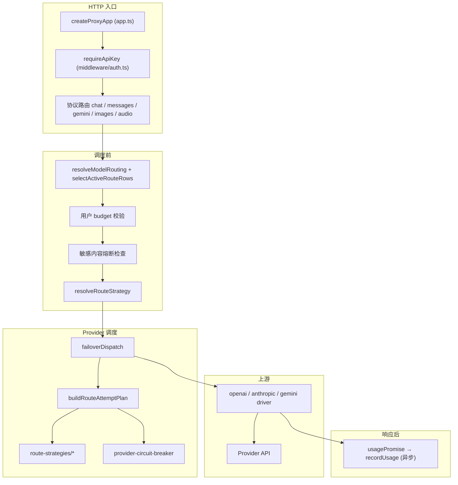
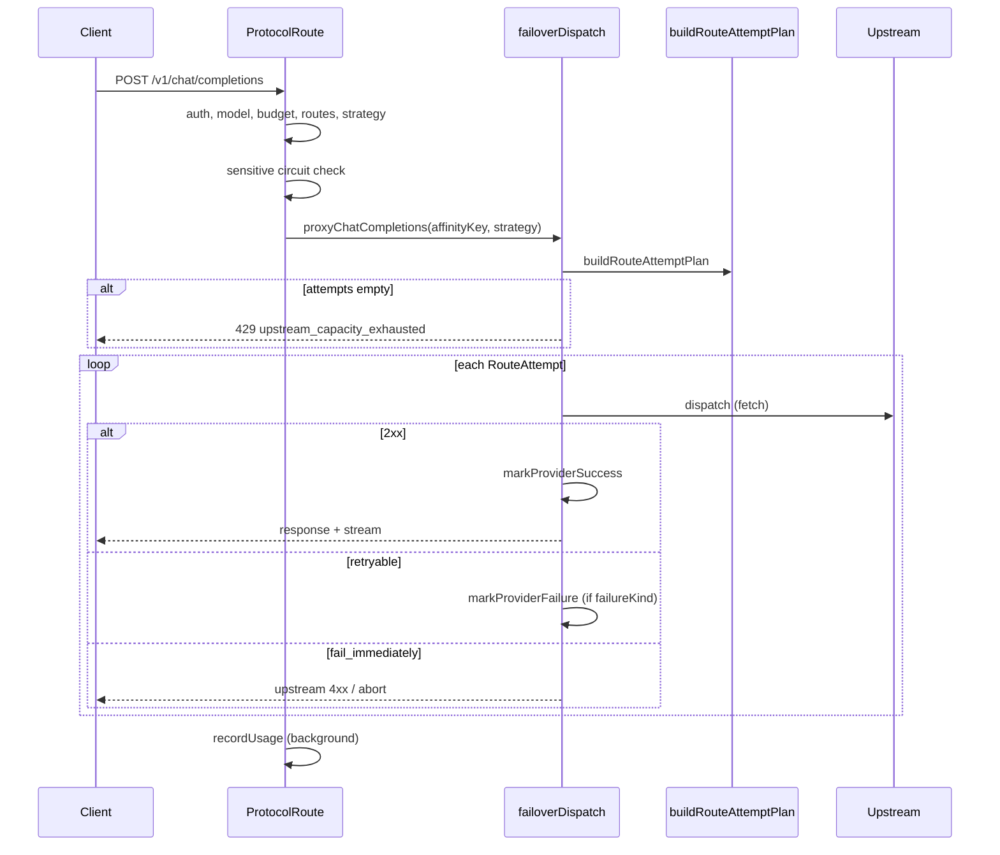

# Proxy 请求处理逻辑

本文档描述 **octafuse-gateway** `packages/proxy` 在收到一次 AI 推理请求后，从 HTTP 入口到上游 provider 调用、故障转移、异步记账的完整处理路径。

**适用路由**（三协议共用同一调度内核，差异仅在协议过滤与 egress driver）：

| 入口 | 协议 | 路由文件 |
|------|------|----------|
| `POST /v1/chat/completions` | OpenAI | `packages/proxy/src/routes/v1/chat.ts` |
| `POST /v1/messages` | Anthropic | `packages/proxy/src/routes/v1/messages.ts` |
| `POST /v1beta/models/{model}:generateContent` 等 | Gemini | `packages/proxy/src/routes/v1/gemini.ts` |

**相关文档**：

- 运行时状态与配置列概览：[runtime-data.md](./runtime-data.md) § 路由调度运行时状态
- 路由策略详解：[../reference/route-strategies.md](../reference/route-strategies.md)
- 用户 API 故障转移摘要：[../api/user.md](../api/user.md) § 提供商故障转移
- 流式计费与 usage 解析：[../reference/streaming-billing.md](../reference/streaming-billing.md)

---

## 1. 入口与组件



| 组件 | 文件 | 职责 |
|------|------|------|
| App 装配 | `packages/proxy/src/app.ts` | Hono 应用、路由挂载、注入 `repositories` |
| 鉴权 | `middleware/auth.ts` → `services/api-key-auth.ts` | 提取 sk、校验用户 API Key、懒重置预算周期 |
| 模型路由 | `resolve-model-route-group.ts`、`route-selection.ts`、`model-router.ts` | 解析 `model` / `:route_group`、查 `model_routes`、JOIN provider（单键 `api_key`） |
| 策略解析 | `route-strategies/index.ts` → `resolveRouteStrategy` | 五级：capability rule → protocol rule → model → global → `affinity` |
| 代理入口 | `services/proxy.ts` | 三协议（及 Images / Audio）统一调用 `failoverDispatch` |
| 故障转移 | `services/failover-dispatch.ts` | 编排 attempt、逐 provider 打上游、熔断与 429 全忙 |
| 调度计划 | `services/route-attempt-planner.ts` | `buildRouteAttemptPlan`：priority 硬序 + 层内策略排序 + 跳过熔断 provider |
| Provider 熔断 | `services/provider-circuit-breaker.ts` | 按 `providers.id`：429 / 401 / 403 / 5xx |
| 失败分类 | `services/upstream-failure-classifier.ts` | 决定 retry（换 provider）vs fail_immediately |
| 敏感内容熔断 | `services/sensitive-content-circuit-*.ts` | 独立于 provider，按 user + model 短路 |
| 用量记账 | `services/usage-tracker.ts` | 流结束后写 `api_key_request_logs`、累加 `budget_spent` |

> **已移除（待后续重设计）**：provider key pool、粘性 key 绑定（`sticky_config`）、网关侧 RPM/TPM/并发软限流（`limit_config`）。一个 Provider = 一把 `api_key` + `status`。

---

## 2. 请求生命周期（逐步）

以下以 `POST /v1/chat/completions` 为例；`/v1/messages`、Gemini、Images、Audio 在「协议过滤」与 driver 处不同，调度内核一致。

### 2.1 鉴权与解析

1. **`requireApiKey`**：从 `Authorization: Bearer sk-...`、`x-api-key` 或 query `key` 提取密钥；`authenticateApiKey` 查库并注入 `c.set('apiKey')`（含 `userId`、`budgetMax`、`budgetSpent` 等）。
2. **解析 JSON body**：非法 JSON → **400**；缺少 `model` → **400**。
3. **`resolveModelRouting`**：支持 `baseModelId` 或 `baseModelId:route_group`；模型不存在 → **404**。
4. **用户预算**：`budgetMax != null && budgetSpent >= budgetMax` → **403**。
5. **路由行查询**：
   - `getActiveModelRouteRows` → `selectActiveRouteRows(explicitGroup)`（默认 `default`）
   - `resolveRouteResultsFromRows` → `RouteResult[]`（携带 `providerEndpoints`、`providerApiKey`、`routePriority`、`routeWeight`；**provider disabled / 无 api_key 的行会被跳过**）
   - 无有效 route group → **400**
   - 解析异常 → **502**
6. **协议过滤**：例如 chat 路由保留 `upstreamProtocol === 'openai'`；无匹配 → **502**。
7. **`resolveRouteStrategy`**：读 `models.route_policy` + `system_config.ROUTE_STRATEGY`（见 [route-strategies.md](../reference/route-strategies.md)）。
8. **Driver 出站 URL**：各 driver 按 capability 调用 `resolveUpstreamEndpoint`；Gemini 鉴权与 `alt=sse` 仍由 `prepareGeminiUpstreamFetch` 处理。

### 2.2 敏感内容熔断（可选，调度前）

- **`maybeBlockSensitiveContentCircuit`**：若 `userId + baseModelId` 处于熔断窗口（默认 **180s**），**不打上游**，返回 **429**，并异步记 error 日志。
- 上游 4xx 响应体命中敏感内容规则时，**`maybeTriggerSensitiveContentCircuitFromUpstream`** 写入熔断窗口；与 provider 熔断 **独立**。

### 2.3 Provider 调度与上游调用

**`proxyChatCompletions` → `failoverDispatch`**：

1. 再次按 `expectedProtocol` 过滤 routes。
2. 无可用 route → **502** `No routes configured`。
3. **`buildRouteAttemptPlan`**：按 priority 分层 → 层内策略排序 → 跳过熔断中的 provider（见 §3）。
4. **`plan.attempts.length === 0`**（全部熔断）→ **429** `upstream_capacity_exhausted` + `Retry-After`（**零上游调用**）。
5. **逐 attempt 执行**：
   - 调用协议 driver（`fetch` 上游）
   - **成功 (2xx)**：`markProviderSuccess` → 返回响应
   - **fetch 异常**：内部记 502 → **换下一 provider**（同次 failover；**不**写跨请求熔断）
   - **非 2xx**：`classifyUpstreamHttpFailure`：
     - `fail_immediately`（400/404 等；Images abort 的合成 504）→ **直接返回该响应**，不重试
     - `retry_key` → 按类别 `markProviderFailure`（若有 `failureKind`）→ **换下一 provider**
6. 全部 attempt 失败 → 返回**最后一次**上游响应（可能是 429/5xx/4xx）。

### 2.4 响应与异步记账

1. **`materializeNonOkResponse`**：非 2xx 时物化 body 供日志与敏感内容检测。
2. **`usagePromise`** 与 **5min 超时** race：流结束解析 token；超时记 `incomplete`。
3. **`scheduleBackgroundWork` → `recordUsage`**：写 `api_key_request_logs`、累加 `budget_spent`；失败时可选 webhook 告警。



---

## 3. 路由调度决策顺序

`buildRouteAttemptPlan`（`route-attempt-planner.ts`）是 **priority 分层、层内策略、provider 熔断** 的交汇点。

### 3.1 排序规则

1. 按 **`model_routes.priority` 降序**分层（数字越大越先试）。
2. **同层（同 priority）** 内调用当前策略（`affinity` / `weighted_random` / `strict` / `round_robin`）排序；策略使用 `model_routes.weight`（默认 1）。
3. 对每个候选：若 **`getProviderCircuitRemainingMs(providerId) > 0`** → 跳过，记录最早恢复时间。
4. 高 priority 层全部试完（或跳过）后，才进入下一层。

策略语义、affinityKey / tierKey、五级解析见 [route-strategies.md](../reference/route-strategies.md)。

### 3.2 Provider 熔断策略

熔断维度为 **`providers.id`**（单键化后不再有 per-key 熔断）。

| 失败类别 | 触发 | 冷却 |
|----------|------|------|
| `rate_limit` | 上游 **429** | 优先 `Retry-After`（封顶 15min）；否则连续 429 递增：**5s → 15s → 30s → 60s（封顶）** |
| `auth` | **401 / 403** | 固定 **10min** + 告警日志 |
| `server` | 普通 **5xx** | 连续 **3** 次后短熔断 **10s** |

- **524** 与 **fetch 抛错**：仅同次请求内 failover，**不**写入跨请求熔断。
- `openUntil = max(现有, now + cooldown)`，短冷却不会覆盖更长冷却。
- **成功 (2xx)** → `markProviderSuccess`，清零连续 429 / server 计数。
- 熔断中的 provider **一律跳过**。

### 3.3 粘性 / 限流说明

- **无**进程内 sticky key 绑定；默认策略 **`affinity`**（加权 Rendezvous hash）在同用户 + 模型 + group + 协议下给出稳定首选 provider，以利于上游 prompt cache。
- **无**网关侧 RPM/TPM/并发软限流；供应商限额由上游 429 与熔断间接体现（后续可能重设计）。

> **Playground 除外**：Admin **`playground-service`** 直连单条 route 打上游，**不经过** `failoverDispatch`，因此无 failover / 策略排序；生产 Proxy 路径才生效。

---

## 4. 场景分支表

### 4.1 调度前短路（不打上游）

| 场景 | HTTP | 响应要点 | 是否记账 |
|------|------|----------|----------|
| 非法 JSON | 400 | `Invalid JSON body` | 否 |
| 缺少 model | 400 | `Missing model` | 否 |
| 模型不存在 | 404 | `Model not found` | 否 |
| 用户 budget 耗尽 | 403 | `Budget exceeded` | 否 |
| route group 无 active 路由 | 400 | `No active routes for route group ...` | 否 |
| 无协议匹配路由 / 无可用 provider | 502 | `No OpenAI route ...` / `No routes configured` 等 | 否 |
| 敏感内容熔断中 | 429 | 网关生成，含 retry 信息 | 是（error） |
| 全部 provider 熔断 | 429 | `upstream_capacity_exhausted` + `Retry-After` | 否 |

### 4.2 调度后 / 上游交互

| 场景 | 行为 | 客户端最终看到 |
|------|------|----------------|
| 首个 attempt 2xx | 成功返回 | 上游 2xx + stream |
| 上游 429 | 熔断该 provider，换下一 route | 若后续成功 → 2xx；全失败 → 最后上游 429 |
| 上游普通 5xx | 累计；连续 3 次后 10s 熔断，换 provider | 最后上游 5xx 或后续成功 |
| 上游 401/403 | 10min 熔断 + warn 日志，换 provider | 最后上游响应或后续成功 |
| 上游 400/404 等 | **fail_immediately**，不重试 | 直接透传该 4xx |
| fetch 网络错误 / 524 | 同次换 provider，不跨请求熔断 | 全失败时最后 502 或上游响应 |
| Images 客户端取消 / Gateway 超时 | 合成 504，**禁止** failover | 504 |
| 流式 usage 5min 未就绪 | **不**触发 provider 熔断 | 2xx 仍返回；日志 `incomplete` |

### 4.3 两类 429 的区别

| 来源 | 含义 | Body 特征 |
|------|------|-----------|
| **网关生成** | 调度阶段无任何可试 provider | `code: upstream_capacity_exhausted`，**未调用上游** |
| **上游返回** | 某 provider 被供应商限流 | 换 provider 重试；全失败则**透传最后上游 429** |

---

## 5. 状态与一致性

以下为**单实例进程内存**（与敏感内容熔断相同）：

| 状态 | 作用域 | Workers 多 isolate |
|------|--------|-------------------|
| Provider 熔断 | per `providerId` | 各 isolate 独立 → **软限制** |
| Round-robin 计数 | per `tierKey` | 同上 |
| 敏感内容熔断 | per `userId + baseModelId` | 同上 |
| `ROUTE_STRATEGY` 缓存 | 全局，TTL **30s** | 各 isolate 独立缓存 |

**配置来源**（迁移 **0015**，三库同语义）：

| 列 / 键 | 含义 |
|---------|------|
| `providers.api_key` / `providers.status` | 单键；`active` \| `disabled` |
| `model_routes.priority` / `weight` | 层（DESC）+ 层内权重（默认 1） |
| `models.route_policy` | 可选 per-model / per-capability 策略覆盖 |
| `system_config.ROUTE_STRATEGY` | 全局缺省（默认 `affinity`） |

---

## 6. 可观测性与日志

### 6.1 关键日志（Proxy stdout）

| 日志片段 | 含义 |
|----------|------|
| `calling provider providerId=...` | 开始 attempt |
| `provider non-OK, trying next candidate ... status=...` | 可重试失败，换 provider |
| `fetch failed ... error=...` | 网络/fetch 异常 |
| `provider auth issue, trying next provider ...` | 401/403 告警 |
| `recordUsage failed ...` | 后台记账失败 |

### 6.2 用量日志字段

成功或失败后均异步写入 `api_key_request_logs`，含：

- `provider_key_id` / `provider_key_label` / `provider_key_fingerprint`：**现为** `providers.id` / `providers.name` / `fingerprint(api_key)`（列名历史兼容）
- `route_group`、`request_protocol`、`upstream_protocol`
- `status`：`success` / `error` / `incomplete` / `cancelled`
- `metered_cost` / `charged_cost` 等（见 streaming-billing 文档）

### 6.3 错误告警 Webhook

Proxy 在 `status = error` 且用量写入成功后，可向企业微信/飞书 webhook 发送归类摘要。配置见 [admin.md](../api/admin.md)。

---

## 7. 代码索引（快速跳转）

```
packages/proxy/src/
├── app.ts                          # 路由挂载
├── middleware/auth.ts              # requireApiKey
├── routes/v1/
│   ├── chat.ts                     # OpenAI 主链路模板
│   ├── messages.ts                 # Anthropic
│   ├── gemini.ts                   # Gemini
│   ├── images.ts / audio.ts        # Images / Audio
└── services/
    ├── proxy.ts                    # → failoverDispatch
    ├── failover-dispatch.ts        # 调度执行、429 全忙
    ├── route-attempt-planner.ts    # buildRouteAttemptPlan
    ├── route-strategies/           # affinity / weighted_random / strict / round_robin
    ├── provider-circuit-breaker.ts
    ├── upstream-failure-classifier.ts
    ├── sensitive-content-circuit-route.ts
    └── usage-tracker.ts
```

单测契约见 `packages/proxy/src/services/*.test.ts`（`failover-dispatch.test.ts`、`route-attempt-planner.test.ts`、`route-strategies/*.test.ts` 等）。
